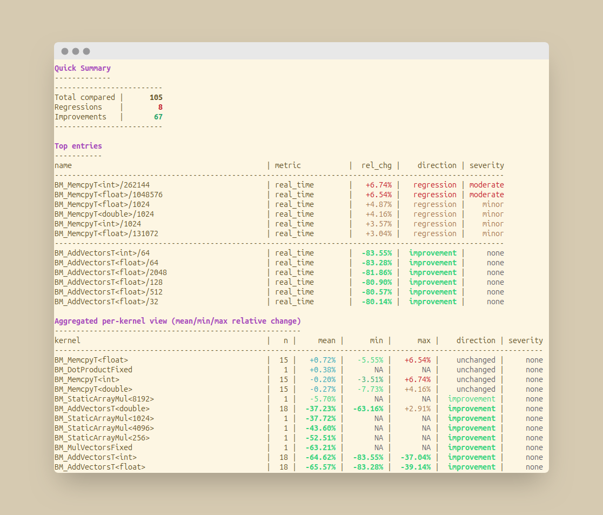

BenchDiff
===========

**BenchDiff** is a visual tool for spotting performance regressions and improvements in [Google Benchmark](https://github.com/google/benchmark) traces.

Unlike the `compare.py` script bundled with Google Benchmark, BenchDiff provides:
- **Clear visual output** with severity-based coloring (minor/moderate/major)
- **Per-kernel aggregation** to easily analyze templated benchmarks (e.g., `BM_Add<float>/1024`, `BM_Add<float>/2048`...)
- **Concise summary** of top regressions and improvements

Designed for local development: run, compare, instantly see what changed.



Features
--------

- **Input**: two JSON traces from Google Benchmark (reference vs current)
- **Auto-metric selection**: `real_time`, `cpu_time`, `bytes_per_second`, `items_per_second`
- **Regression classification** with configurable thresholds (minor/moderate/major)
- **ANSI colors** for quick visual scanning
- **CI mode** (`--ci`) with fail-on-severity and exit codes for automation

Install
-------

Requires Python 3.10+

```bash
pip install benchdiff
```

Or from source:

```bash
git clone https://github.com/sbstndb/BenchDiff.git
cd BenchDiff
pip install -e .
```

Usage
-----

- Basic:
  - `benchdiff --ref baseline.json --cur current.json --metric real_time`
- CI gate:
  - `benchdiff --ref baseline.json --cur current.json --metric real_time --ci --ci-fail-on major --ci-max-top-reg-pct 10`
- Filter benchmarks by name (regex, similar to Google Benchmark `--benchmark_filter`):
  - `benchdiff --ref baseline.json --cur current.json --benchmark-filter "^BM_AddVectorsT<.*>/[0-9]+$"`

Demo (C++ microbenchmarks)
--------------------------

A minimal Google Benchmark demo is under `demo/cpp_bench`.

- Build:
  - `cmake -S demo/cpp_bench -B demo/cpp_bench/build -DCMAKE_BUILD_TYPE=Release`
  - `cmake --build demo/cpp_bench/build -j`

- Produce traces:
  - `mkdir -p demo/output`
  - `demo/cpp_bench/build/bench_demo --benchmark_out=demo/output/baseline.json --benchmark_out_format=json`
  - `demo/cpp_bench/build/bench_demo --benchmark_out=demo/output/current.json  --benchmark_out_format=json`

- Analyze:
  - `benchdiff --ref demo/output/baseline.json --cur demo/output/current.json --metric real_time`

Project structure
-----------------

The project is organized into focused modules under `src/benchdiff/`:

- `compare.py`: core comparison logic and CI gating
- `report.py`: terminal rendering (colors, tables, sections)
- `cli.py`: argument parsing and orchestration
- `color_utils.py`: ANSI color utilities

Example output
--------------

Quick test with included sample data:

```bash
benchdiff --ref demo/baseline_O2.json --cur demo/current_O3_native.json --metric real_time
```

Or generate fresh traces with the C++ demo:

```bash
bash demo/run_demo.sh
benchdiff --ref demo/output/baseline.json --cur demo/output/current.json --metric real_time
```

License
-------

BSD 3-Clause
